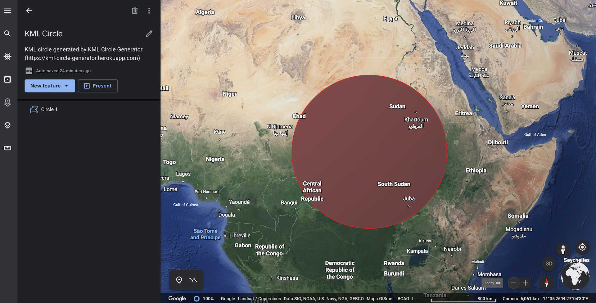

KML Circle Generator
=================================

Generate [KML](https://developers.google.com/kml) circles for [Google Earth](https://earth.google.com/web/)

> See this video below for a demo.

## Live server

[kml-circle-generator.herokuapp.com](https://kml-circle-generator.herokuapp.com/)

## Local development

This project is created using [Play framework](https://www.playframework.com/).

Start the project using `sbt run` and access `http://localhost:9000`.